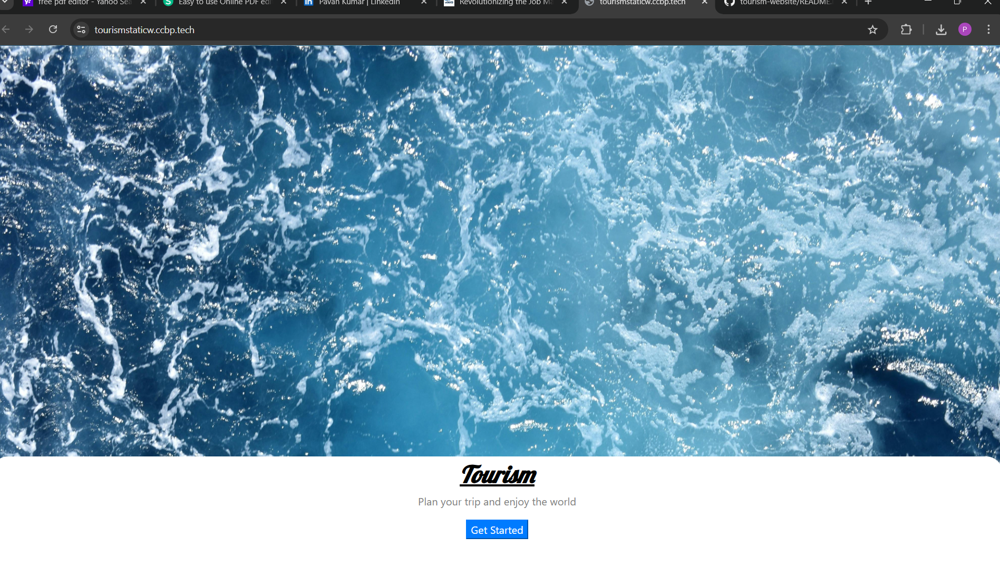
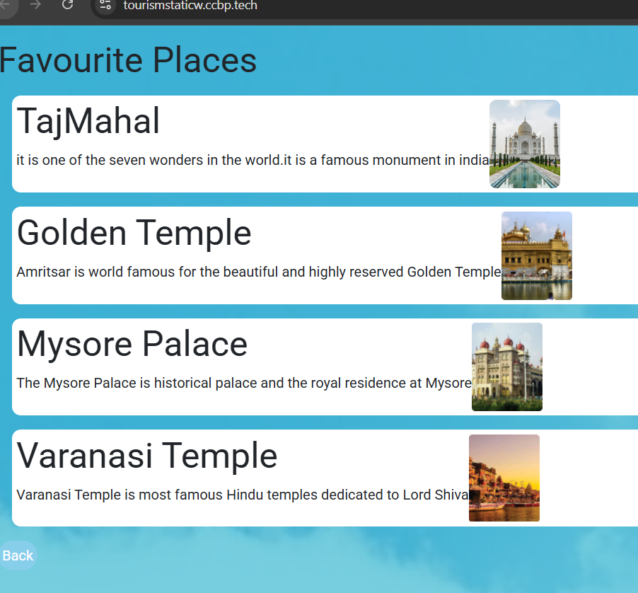
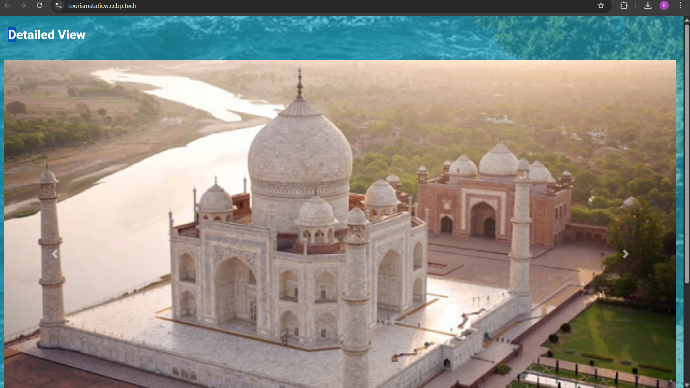

# 🌍 Tourism Website

## 📌 Overview
A modern and responsive tourism website designed to showcase popular travel destinations with an engaging user interface. The project focuses on clean design, smooth navigation, and mobile responsiveness.

## 🚀 Features
- Fully responsive design (mobile, tablet, desktop)
- Visually appealing layout with structured sections
- Smooth navigation and user-friendly interface
- Organized content for better readability

## 🛠️ Tech Stack
- HTML5
- CSS3

## 🎯 Key Highlights
- Designed with a focus on UI/UX principles
- Implemented responsive layouts using modern CSS techniques
- Structured webpage for scalability and easy maintenance

## 🔗 Live Demo
👉 https://tourismstaticw.ccbp.tech/

## 📷 Screenshots

## 👨‍💻 Author
*Tanikonda Pavan Kumar*  
B.Tech CSE | Aspiring Full Stack Developer
